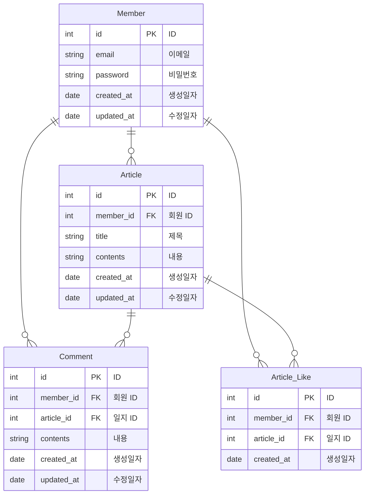

# 공부 일지 서비스

> 항해99 5조 주특기 프로젝트

## 🔧 구현 기능

- [x] 회원 가입 기능
- [x] 로그인 기능
    - Access Token 발행
- [x] 회원 정보 수정 기능
    - 비밀번호 변경
- [x] 작성한 일지 목록 조회 기능
- [x] 일지 CRUD 기능
    - 일지 작성, 조회, 수정, 삭제
- [x] 일지 검색 기능
    - 제목, 내용, 작성자
- [x] 일지 좋아요 기능
    - 좋아요, 좋아요 취소
- [x] 일지 댓글 CRUD 기능
    - 댓글 작성, 조회, 수정, 삭제

## 📚 스택

- JDK 17
- Spring Boot 3.1.9
- Spring Boot JPA
- Spring Boot Validation
- Spring Boot Security
- Swagger UI
- QueryDsl
- JWT
- Elastic Beanstalk, EC2, RDS
- MySQL
- Github Actions

## 🖼️ Use Case Diagram

## 🔖 ERD

## 📄 API 명세서

URL: http://hanghae-5.ap-northeast-2.elasticbeanstalk.com/swagger-ui/index.html

## 📐 시스템 아키텍처

